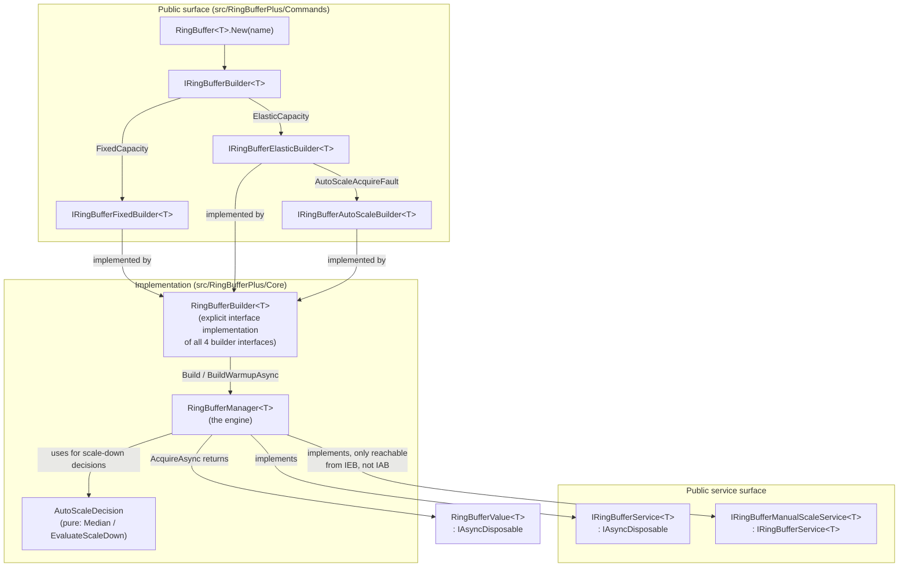

# Architecture overview

[**Back to README**](../../README.md)

This is a map for contributors: what the main components are and how they connect. It intentionally does not restate *why* things are shaped this way — every design decision here is traceable to an ADR in [doc/adr](../adr), and those ADRs are the source of truth if this document and the code ever disagree.

## Components

- **`RingBufferBuilder<T>`** (`src/RingBufferPlus/Core/RingBufferBuilder.cs`) is a single class implementing all four builder interfaces via explicit interface implementation, so the same method names (`Factory`, `Logger`, …) return different interface types depending on which mode you're in — this is what makes `AutoScaleAcquireFault` permanently hide `SwitchToAsync` at compile time. See [ADR007](../adr/ADR007V01-redesign-of-the-public-fluent-api-surface.md).
- **`RingBufferManager<T>`** (`src/RingBufferPlus/Core/RingBufferManager.cs`) is the only concrete implementation of `IRingBufferService<T>`/`IRingBufferManualScaleService<T>`. It owns three `System.Threading.Channels.Channel<T>`-family queues (available items, engine commands, background log messages) and a single consumer loop that is the sole writer of scale state. See [ADR001](../adr/ADR001V01-concurrency-model-for-ringbuffermanager-scale-up-and-down.md).
- **`AutoScaleDecision`** (`src/RingBufferPlus/Core/AutoScaleDecision.cs`) is a pure static class — `Median(samples)` and `EvaluateScaleDown(...)` take primitive inputs and return a decision with no dependency on the engine, specifically so the autoscale algorithm can be unit-tested and benchmarked in isolation. See [ADR003](../adr/ADR003V01-median-sample-autoscaling-algorithm.md).
- **`RingBufferValue<T>`** (`src/RingBufferPlus/RingBufferValue.cs`) is the rented-item wrapper returned by `AcquireAsync`. Disposing it (`await using`) invokes the manager's turnback callback, which either returns the item to the pool or, if `Invalidate()` was called, discards it and queues a replacement.
- **Observability**: each `RingBufferManager<T>` owns its own `Meter`/`ActivitySource` (not one static instance for the whole assembly), both named `"RingBufferPlus"` — per-instance so disposing one buffer can never silence another's telemetry, while a single exporter subscription by name still sees every buffer, disambiguated by a `buffer.name` tag. See [ADR008](../adr/ADR008V01-native-observability-via-open-telemetry-compatible-metrics-and-tracing.md) and the [observability guide](../guides/usage-observability.md).

## Where things live

| Concern | Path |
|---|---|
| Public builder/service interfaces | `src/RingBufferPlus/Commands/` |
| Engine + builder implementation | `src/RingBufferPlus/Core/` |
| DI integration (`AddRingBuffer`, `WarmupRingBufferAsync`) | `src/RingBufferPlus/HostingExtensions.cs` |
| Behavioral contract tests (the acceptance gate for any engine change) | `src/RingBufferPlus.Tests/RingBufferContractTests.cs` |
| Autoscale algorithm unit tests | `src/RingBufferPlus.Tests/AutoScaleDecisionTests.cs` |
| Observability (metrics/tracing) tests | `src/RingBufferPlus.Tests/RingBufferObservabilityTests.cs` |
| Quantitative benchmarks (throughput, scale cost, autoscale reaction time, observability overhead) | `benchmarks/RingBufferPlus.Benchmarks/` |
| All architecture decisions, with context/trade-offs/consequences | `doc/adr/` |

## Contributing to the engine

Any change to `RingBufferManager<T>`'s concurrency behavior must keep `RingBufferContractTests.cs` green across all three target frameworks (`net8.0`/`net9.0`/`net10.0` — [ADR002](../adr/ADR002V01-multi-targeting-policy-for-net8-net9-net10-and-test-matrix.md)) before anything else is considered — that suite encodes the behavioral contract the engine rewrite was built against, independent of implementation. If you're changing *why* something is shaped a certain way, revise or supersede the relevant ADR rather than just changing a comment — see `CONTRIBUTING.md`.
