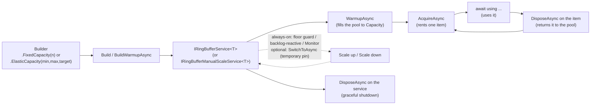

# Concepts

[**Back to README**](../../README.md)

This guide gives you the mental model to read before touching the API reference or the usage guides. It answers: what is a ring buffer here, what do `Capacity`/`MinCapacity`/`MaxCapacity` mean, how does an instance move through its lifecycle, and when should you *not* reach for this library.

> **Reading the code samples in every guide:** they're deliberately minimal, not complete programs. `logger` (an `ILogger?`) and `cancellation` (a `CancellationToken`) appear without being declared — assume they already exist from your own composition root, e.g. `ILoggerFactory.CreateLogger<T>()` and `IHostApplicationLifetime.ApplicationStopping`, the same way the [dependency injection guide](usage-dependency-injection.md) gets them. Pass `null`/`CancellationToken.None` if you're just trying a snippet out with nothing wired up yet — both are optional in practice (`Logger(null)` disables logging; a default token never cancels).

- [What RingBufferPlus is](#what-ringbufferplus-is)
- [Capacity, MinCapacity, MaxCapacity](#capacity-mincapacity-maxcapacity)
- [Lifecycle](#lifecycle)
- [Internal design: a single-consumer engine](#internal-design-a-single-consumer-engine)
- [Thread-safety and dependency injection](#thread-safety-and-dependency-injection)
- [When not to use RingBufferPlus](#when-not-to-use-ringbufferplus)

## What RingBufferPlus is

A ring buffer is a bounded pool of pre-built instances of `T` (database connections, RabbitMQ channels, any expensive-to-construct object). Callers `AcquireAsync` an instance, use it, and return it to the pool by disposing the wrapper (`await using`). The "plus" is elastic capacity: the pool can grow and shrink at runtime, either on a manual command or automatically in reaction to acquisition pressure — see [ADR001](../adr/ADR001V02-concurrency-model-for-ring-buffer-manager-scale-up-and-down.md) and [ADR003](../adr/ADR003V02-median-sample-autoscaling-algorithm.md).

Every instance is built once via the `Factory` you supply, and each build is exactly one call to that factory — the buffer never mutates or resets an item on your behalf.

## Capacity, MinCapacity, MaxCapacity

These three numbers only exist for an elastic buffer ([`ElasticCapacity`](usage-elastic-manual-scale.md)). A fixed buffer ([`FixedCapacity`](usage-fixed-capacity.md)) has exactly one capacity value and never scales.

| Property | Meaning |
|---|---|
| `Capacity` | The initial/startup capacity — where the buffer starts after warmup, and the target `SwitchToAsync(ScaleSwitch.InitCapacity)` returns to. |
| `MinCapacity` | The floor. The buffer never holds fewer items than this while running. |
| `MaxCapacity` | The ceiling. The buffer never holds more items than this. |

`IsInitCapacity`, `IsMinCapacity`, `IsMaxCapacity` on `IRingBufferService<T>` tell you which of the three the buffer is currently sitting at (all three are `false` while a scale operation is moving it between two of these points).

## Lifecycle

Concretely:

1. **Configure** — start from `RingBuffer<T>.New(name)`, set `Factory` (required) and any of `Logger`, `HeartBeat`, `AcquireTimeout`, `OnError`, then commit to a mode with `FixedCapacity(n)` or `ElasticCapacity(init, min, max, ...)`. In the generated API reference, these shared operations look duplicated - `Factory`, `HeartBeat`, `AcquireTimeout`, `OnError` are each declared on all 3 builder interfaces (`IRingBufferBuilder<T>`, `IRingBufferFixedBuilder<T>`, `IRingBufferElasticBuilder<T>`) instead of once on a shared base. That is deliberate, not an oversight: each interface's own version returns *that same interface type*, so the fluent chain stays within the mode you already committed to (fixed vs. elastic) instead of widening back out to a less specific type - see [ADR007V03](../adr/ADR007V03-redesign-of-the-public-fluent-api-surface.md) for why the chain is split into mode-specific types in the first place.
2. **Build** — `Build(cancellation)` constructs the service without filling it; `BuildWarmupAsync(cancellation)` also waits until the pool reaches `Capacity` (recommended — see [ADR005](../adr/ADR005V01-async-disposal-strategy-and-graceful-shutdown.md) for why warmup is now explicit and awaitable, and the [dependency injection guide](usage-dependency-injection.md) if you're not calling `BuildWarmupAsync` directly).
3. **Acquire / release** — `AcquireAsync` returns a `RingBufferValue<T>`; disposing it (`await using`) returns the item to the pool. Call `Invalidate()` before disposing to discard the item instead of returning it — a replacement is created in its place.
4. **Scale** (elastic only) — the floor guard, backlog-reactive signal, and Monitor are always active, reacting to a floor breach, real waiting callers, and a demand trend respectively (see [ADR001V03](../adr/ADR001V03-concurrency-model-for-ring-buffer-manager-scale-up-and-down.md)/[ADR003V03](../adr/ADR003V03-median-sample-autoscaling-algorithm.md)). You can additionally call `SwitchToAsync(ScaleSwitch.MinCapacity | InitCapacity | MaxCapacity, pinDuration)` yourself to pin a capacity for a required duration, substituting for the Monitor's own output for that long — it never suppresses the floor guard or backlog-reactive signal (see [ADR007V03](../adr/ADR007V03-redesign-of-the-public-fluent-api-surface.md)).
5. **Dispose** — `await using`/`DisposeAsync()` on the service itself stops all background activity (heartbeat, sampling, logging) and disposes every item still in the pool - each idle item's own `Dispose()`/`DisposeAsync()` is itself bounded by `pulse`, so a hung one doesn't block shutdown forever; it's logged and left to finish in the background instead. This is the only disposal contract — there is no synchronous `Dispose()` ([ADR005](../adr/ADR005V01-async-disposal-strategy-and-graceful-shutdown.md)). If a `HeartBeat` callback is also still orphaned from a previous timeout when this runs, `DisposeAsync()` can take up to an extra `pulse` interval on top of that, waiting for its deferred resource disposal to finish - see the [heartbeat guide](usage-heartbeat.md) if you're budgeting a shutdown grace period around this.

## Internal design: a single-consumer engine

Every `RingBufferManager<T>` owns exactly one background loop that is the sole writer of the buffer's scale state (current capacity, in-flight scale operations, the active manual pin, if any). Warmup, manual switches, the floor guard, backlog-reactive signal, and Monitor sampling all funnel through this one loop as commands — there is no lock or semaphore protecting shared mutable state, because there is no state shared between threads to protect: only the engine loop ever touches it ([ADR001V03](../adr/ADR001V03-concurrency-model-for-ring-buffer-manager-scale-up-and-down.md)).

`AcquireAsync` does **not** go through that command loop — it reads directly from the pool of already-built items, so an in-progress scale operation never blocks an acquire that has an item available, regardless of `LockWhenScaling`. That setting affects something else entirely — see the [lock guide](usage-lock-when-scaling.md).

## Thread-safety and dependency injection

- A single `IRingBufferService<T>` instance is safe to call `AcquireAsync`/`SwitchToAsync` from any number of threads/tasks concurrently — that is the entire point of the pool.
- Register it as a **singleton**. Building a new instance per request/scope re-runs the factory for every item and defeats the purpose of pooling — see the [dependency injection guide](usage-dependency-injection.md) for `AddRingBuffer` (which also registers the `IHostedService` that warms it up automatically at host start).
- Do not create two `RingBuffer<T>.New(...)` instances with the same `name` and the same `T` in the same process unless you specifically intend two independent pools — the name is for your own diagnostics/logging correlation, not for lookup or deduplication (lookup by name only exists inside the hosted service `AddRingBuffer` registers, and only among registered `IRingBufferService<T>` singletons for that `T`).

## When not to use RingBufferPlus

- **The item is cheap to construct.** If `Factory` would just be `new T()` with no I/O, a plain `ObjectPool<T>` or no pooling at all is simpler and has no background threads to reason about.
- **You need exactly one shared instance, not a pool of interchangeable ones** (e.g. a single long-lived `HttpClient`). Register that directly as a singleton instead.
- **The consumer count is unbounded and unrelated to the resource's own concurrency limits** — elastic scaling reacts to acquisition pressure on *this* buffer; it is not a general-purpose autoscaler for unrelated downstream capacity.
