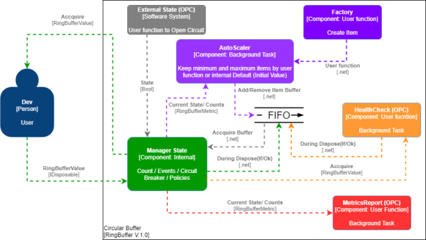

# # **Welcome to RingBufferPlus**
[](https://github.com/FRACerqueira/RingBufferPlus/actions/workflows/build.yml)
[](https://github.com/FRACerqueira/RingBufferPlus/actions/workflows/publish.yml)
[](https://www.nuget.org/packages/RingBufferPlus/)
[](https://www.nuget.org/packages/RingBufferPlus/)
[](https://github.com/FRACerqueira/RingBufferPlus/blob/master/LICENSE)

A generic circular buffer (ring buffer) in C# with Auto-Scaler, Health-Check and Metrics-Report.

## Help

- [Install](#install)
- [Implementation Example](#implementation-example)
- [Apis](#apis)
- [Supported Platforms](#supported-platforms)

## Basic concept

A ring buffer is a memory allocation scheme where memory is reused (reclaimed) when an index, incremented modulo the buffer size, writes over a previously used location.
A ring buffer makes a bounded queue when separate indices are used for inserting and removing data. The queue can be safely shared between threads (or processors) without further synchronization so long as one processor enqueues data and the other dequeues it. (Also, modifications to the read/write pointers must be atomic, and this is a non-blocking queue--an error is returned when trying to write to a full queue or read from an empty queue).

### Implemented concept

The implementation follows the basic principle. 
There is a capacity that is provided to the consumer that may or may not be modified to optimize the consumption of used resources. 
As there may be resources that may become unavailable and/or invalid, the health status validation functionality was added and for critical failure scenarios, a pause for a retry (broken circuit). 
As an extra resource, a metric-report functionality was created to monitor the performance of the component.



## Install
[**Top**](#help)

RingBufferPlus was developed in c# with the **netstandard2.1, .NET 5 AND .NET6** target frameworks.

```
Install-Package RingBufferPlus [-pre]
```

```
dotnet add package RingBufferPlus [--prerelease]
```

**_Note:  [-pre]/[--prerelease] usage for pre-release versions_**

## Implementation Example
[**Top**](#help)

A complete usage example can be seen in the [**RingBufferPlus with RabbitMQ**](https://github.com/FRACerqueira/RingBufferPlus/tree/main/DotNetProbes) project. This project is an implementation of RingBufferPlus for high volume publishing to RabbitMQ queues.

### **RingBufferPlus - Sample Minimum Usage**
[**Top**](#help)

```csharp
public class MyClass
{
   private readonly Guid _id;
   public MyClassTest()
   {
      _id = Guid.NewGuid();
   }
   public Guid Id => _id;
}

var rb = RingBuffer<MyClass>
        .CreateBuffer() //default 2 (Initial/min/max)
        .MaxBuffer(10)
        .Factory((ctk) => new MyClass())
        .Build()
        .Run();

using (var buffer = rb.Accquire())
{ 
   Console.WriteLine(buffer.Id);
}

rb.Dispose();
```

### **RingBufferPlus - Sample Complex Usage**
[**Top**](#help)

```csharp
public class MyClass : IDisposable
{
   private readonly Guid _id;
   private bool _disposedValue;

   public MyClassTest()
   {
      _id = Guid.NewGuid();
   }
   public bool IsValidState => true;	
   public Guid Id => _id;
   protected virtual void Dispose(bool disposing)
   {
      if (!_disposedValue)
      {
         if (disposing)
         {
           _disposedValue = true;
         }
      }
   }
   public void Dispose()
   {
      // Do not change this code. Put cleanup code in 'Dispose(bool disposing)' method
      Dispose(disposing: true);
      GC.SuppressFinalize(this);
   }
}

var build_rb = RingBuffer<MyClass>
                .CreateBuffer(5)
                .MinBuffer(3)
                .MaxBuffer(10)
                .AliasName("Test")
                .SetPolicyTimeout(RingBufferPolicyTimeout.UserPolicy, (metric,ctk) => true)
                .SetTimeoutAccquire(10)
                .SetIntervalAutoScaler(500)
                .SetIntervalHealthCheck(1000)
                .SetIntervalFailureState(TimeSpan.FromSeconds(30))
                .SetIntervalReport(1000)
                .LinkedFailureState(() => true)
                .Factory((ctk) => New MyClass() )
                .HealthCheck((buffer, ctk) => buffer.IsValidState)
                .MetricsReport((metric,ctk) => Console.WriteLine(metric.ErrorCount))
                .AddLogProvider(_loggerFactory,RingBufferLogLevel.Information)
                .AutoScaler((RingBufferMetric, CancellationToken) =>
                {
                   return 5;	
                })
                .Build();

build_rb.AutoScalerCallback += Ring_AutoScalerCallback;
build_rb.ErrorCallBack += Ring_ErrorCallBack;
build_rb.TimeoutCallBack += Ring_TimeoutCallBack;

var rb = build_rb.Run(cancellationToken);

using (var buffer = rb.Accquire())
{ 
   Console.WriteLine(buffer.Id);
}

rb.Dispose();

private void Ring_ErrorCallBack(object sender, RingBufferErrorEventArgs e)
{
   Console.WriteLine($"{e.Alias} => Error: {e.Error?.Message ?? "Null"}.");
}

private void Ring_TimeoutCallBack(object sender, RingBufferTimeoutEventArgs e)
{
   Console.WriteLine($"{e.Alias} => TimeOut = {e.ElapsedTime}");
}

private void Ring_AutoScalerCallback(object sender, RingBufferAutoScaleEventArgs e)
{
   Console.WriteLine($"{e.Alias} => {e.OldCapacity} to {e.NewCapacity}.");
}
```

## Apis
[**Top**](#help)

Title | Details
--- | ---
[CreateBuffer](createbuffer.md) | Create new instance of IRingBuffer and sets the initial capacity of items in the buffer.
[AliasName](aliasname.md) | Set alias to RingBuffer.
[InitialBuffer](initialbuffer.md) | Sets the initial capacity of items in the buffer.
[MaxBuffer](maxbuffer.md) | Sets the maximum capacity of items in the buffer.
[MinBuffer](minbuffer.md) | Sets the minimum capacity of items in the buffer..
[SetPolicyTimeout](policytimeoutaccquire.md) | Sets the timeout policy for acquiring items from the buffer.
[SetTimeoutAccquire](defaulttimeoutaccquire.md) | Sets the default timeout for acquiring items from the buffer. 
[SetIntervalHealthCheck](defaultintervalhealthcheck.md) | Sets the default interval for performing the Integrity Check on a buffer item. 
[SetIntervalAutoScaler](defaultintervalautoscaler.md) | Sets the default interval to perform auto-scaling of buffer items.
[SetIntervalReport](defaultintervalreport.md) | Set the default interval to perform the metric reporting.
[SetIntervalFailureState](defaultintervalfailurestate.md) | Sets the default interval to wait for check when state is failure.
[Factory(Async)](factory.md) | Set create-function to an item in the buffer.
[HealthCheck(Async)](healthcheck.md) | Set the integrity function to a buffer item.
[AutoScaler(Async)](autoscaler.md) | Set the auto-scaling function of buffer items.
[MetricsReport(Async)](metricsreport.md) | Set action for metrics report.
[AddLogProvider](addlogprovider.md) | Set log provider and default message level.
[LinkedFailureState](linkedfailurestate.md) | Extra function to set state "FailureState" in CurrentState.
[Build](ringbufferbuild.md) | Validates all commands and provides the events to be configured.
[ErrorCallBack](errorcallback.md) | Error return event.
[TimeoutCallBack](timeoutcallback.md) | Timeout return event.
[AutoScaleCallback](autoscalecallback.md) | Auto-Scaler return event.
[Run](ringbufferrun.md) | Runs the instance and gives the command to acquire the item from the buffer.
[Accquire](accquire.md) | Acquire an item from the buffer.
[Metric class](metricclass.md) | Metric class details.
[Buffer class](bufferclass.md) | Ring buffer return class details by Accquire method.
[CurrentState class](currentstate.md) | Ring buffer CurrentState class details.

## Supported platforms
[**Top**](#help)

- Windows
- Linux (Ubuntu, etc)

## **License**

This project is licensed under the [MIT License](https://github.com/FRACerqueira/RingBufferPlus/blob/master/LICENSE)
